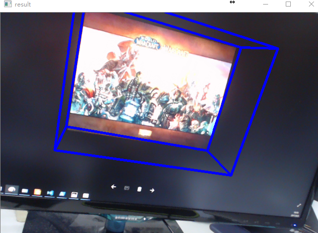

# NaiveAR

NaiveAR:**A** nother **I**mplement of the **V**ersatile and **E**xciting  marker-based AR.



-------------

## instruction

This project is developed on a Mac while modified in Windows.Since it'managed by cmake,it is
probably portable for both platform.Maybe paths in the code are to be redirected.

compile it and run,during which the directories structure should be like this 

```
├─bin
│  └─Debug
│	└─NaiveAR
├─Resource
│  └─Marker
│	└─marker.jpg
└─ambd.voc
```

## Dependencies:

- opencv3
- DBoW3,which is attached in the project

## Besides

As it's a Castrated version of what I readlly made. It's not so robust indeed.Moving your camera
carefully running the program.
